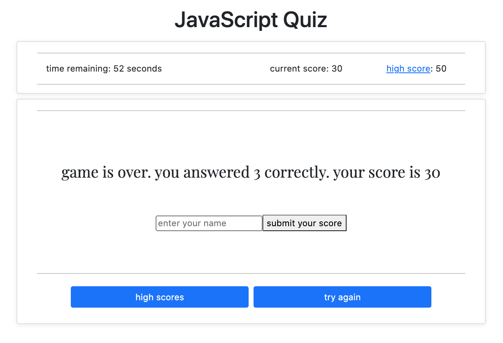
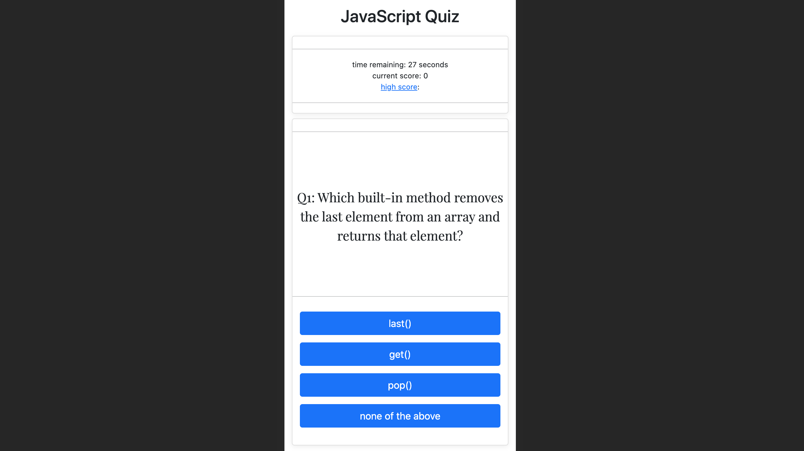

# A Code Quiz

## Description
- A JavaScript fundamentals quiz

### The User Story for this project is as follows:
- A coding boot camp student WANTS to take a timed quiz on JavaScript fundamentals that stores high scores SO THAT they can gauge their progress compared to their peers

### The codebase meets the following criteria for acceptance:
- WHEN I click the start button, THEN a timer starts and I am presented with a question
- WHEN I answer a question, THEN I am presented with another question
- WHEN I answer a question incorrectly, THEN time is subtracted from the clock
- WHEN all questions are answered or the timer reaches 0, THEN the game is over
- WHEN the game is over, THEN I can save my name and my score

### Installation
- The project is uploaded to [GitHub](https://github.com/) at the following repository: [here](https://github.com/sourslaw/04_Code_Quiz)
- Deployed application may be seen: [here](https://sourslaw.github.io/04_Code_Quiz/)

### Usage
- When the 'Start' button is pressed, the quiz begins with 45 seconds given to the user to answer seven questions regarding JavaScript
- Correct answers are awarded 10 points and an additional 10 seconds is added to the timer
- Incorrect answers result in a deduction of 5 seconds from the timer
- When all questions are answered, the user is presented with the number of questons answered correctly and their total score
- The user is presented with the option to view the high scores, submit their name to the high score list, and/or try again
- The high score list may also be accessed via the 'high score' hyperlink in the upper right hand corner
- High scores are saved to local memory and only the top 15 are displayed
- If the timer reaches 0, the game is over

### License
- Licensed under the [MIT](https://opensource.org/licenses/mit-license.php) license.